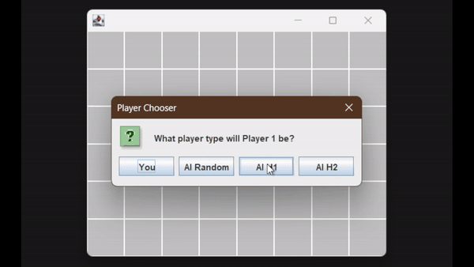

# Isolation (Game)

### AI vs AI demo:

### Player vs AI demo:

# Description

This game is based off of an old board game from 1972. It incorporates some basic AI and the ability to play against another player on the same machine.

For more information, [you can check out this Wikipedia article.](https://en.wikipedia.org/wiki/Isolation_(board_game))

# Requirements

* [Java 17 or higher](https://adoptium.net/temurin/releases/?version=17&package=jdk&arch=x64)

# Usage

Download the jar file from the Releases tab and run it.

The rules of the game are simple.

Every turn has 2 steps:
1. Move
2. Remove a tile from the board

You can only move your piece to cells that have tiles. If a tile has been removed from a cell, you can not move to that cell.

The objective is to isolate your opponent by making it impossible for them to move, while keeping them from isolating you first. The winner is the player who has successfully isolated the other player.
